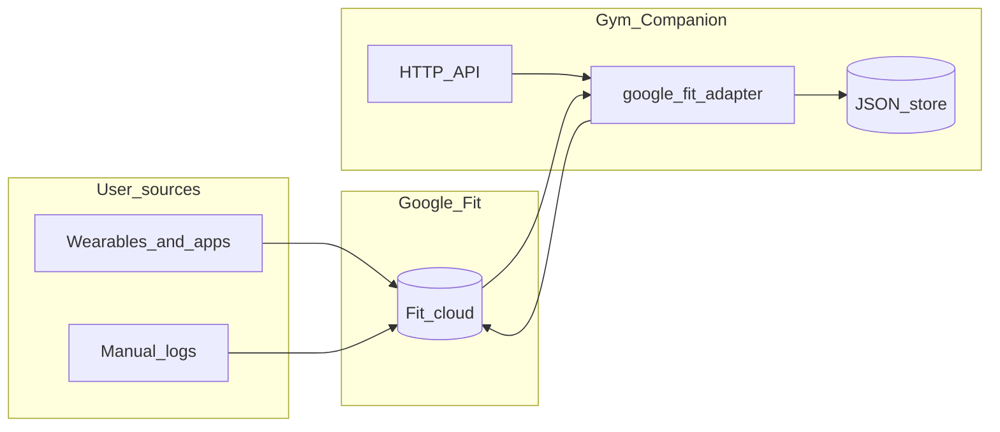

# Architecture

## Principles

- API-first
- Integration-friendly (Pipedream, AI tools, webhooks)
- Provider-agnostic routine ingestion
- Wearable and health **adapters** behind a normalization boundary

## Core flow (routines)

1. Perplexity or another tool generates a routine.
2. Pipedream (or a client) forwards JSON to Gym Companion.
3. Import endpoints validate and persist a normalized routine model.
4. A future frontend uses the API for gym-floor session execution.

## Gym providers (operators and facilities)

**Gym providers** model real-world chains (e.g. Basic-Fit) that operate many **sites** and publish **what equipment exists where**. Data can be imported from companion datasets such as `basicfit-rutina` (`gyms.json` for locations, `equipment.json` for machines with per-location `gyms: number[]`).

- **Routine vs facility**: routines stay user- or AI-authored plans; providers answer “what exists at club X”.
- **Sessions**: `WorkoutSession` may carry optional `gymProviderId` / `gymSiteId` to anchor a workout to a concrete club when logging.

See [`src/core/gym-provider-model.md`](../src/core/gym-provider-model.md) and [`docs/api.md`](api.md#gym-providers-operators).

### Marketplace (distribution)

Packages are listed in a **catalog** (local file or URL), installed via `POST /api/marketplace/install`, and tracked in `installedPackages` beside `gymProviders`. This replaces any notion of a vendor-specific startup seed. Details: [`docs/marketplace.md`](marketplace.md).

## Google Fit as an aggregator

Users may load **workouts** and **health metrics** into Google Fit from multiple vendors and apps. Gym Companion does **not** replace Fit; it **reads** from Fit (Fitness REST API) and maps sessions into internal **`externalActivities`** records so the backend can reason about a **single consolidated stream** alongside locally logged `WorkoutSession` data.

### Responsibility split

- **Local `WorkoutSession`**: execution of **your** prescribed routines (sets/reps/plan) inside Gym Companion.
- **`externalActivities` from Fit**: third-party or cross-app activity timeline used for context, volume, or future enrichment — **read path first**; optional export to Fit can come later.

### OAuth and tokens

OAuth is **server-side only** (`GOOGLE_FIT_CLIENT_SECRET` never ships to a static SPA). Refresh tokens are stored in the JSON store for the MVP; production deployments should move secrets and tokens to a managed secret store and encrypt at rest.

### Sync model

`POST .../sync` performs a bounded time-window pull. Long-term, sync should run as **scheduled jobs** (cron, queue worker) to avoid serverless timeouts and to respect Google quotas.

## Storage (MVP)

Single JSON document (`STORE_PATH`) holds routines, **gym providers** (sites + optional equipment catalog), **marketplace `installedPackages`**, sessions, integration token state, idempotency keys, and external activities. This is a deliberate simplicity tradeoff for early development; migrate to PostgreSQL or similar when multi-user production auth lands.
